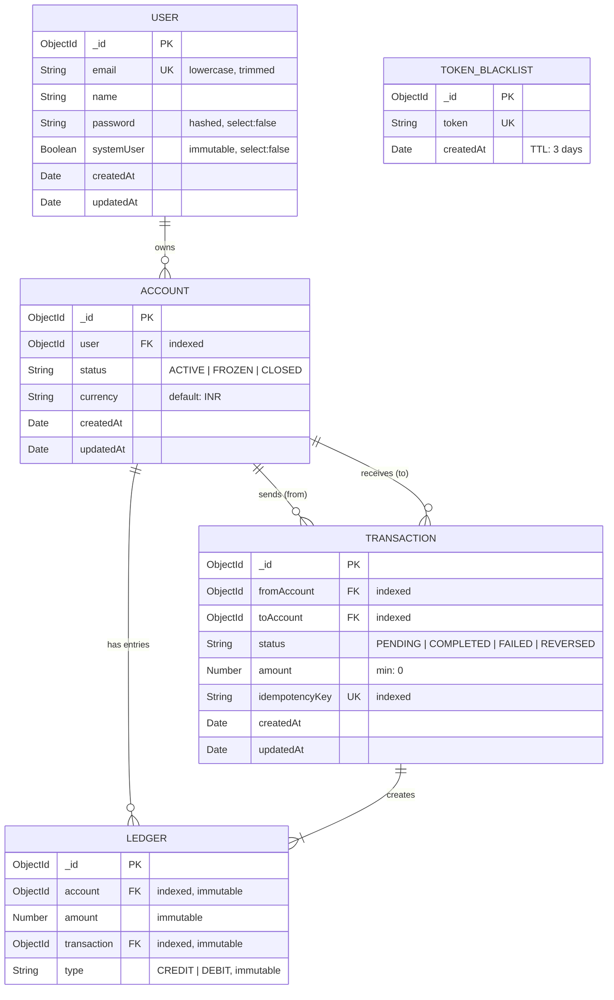

# 🏦 Banking Transaction Management System

A robust, production-grade **backend ledger service** for managing banking transactions with double-entry bookkeeping, ACID-compliant transfers, and enterprise-level security. Built with Node.js, Express, and MongoDB.

---

## 📖 Table of Contents

1. [High-Level Architecture](#-high-level-architecture)
2. [Complete System Flow](#-complete-system-flow)
3. [Key Features](#-key-features)
4. [Technology Stack](#-technology-stack)
5. [Database Schema Design](#-database-schema-design)
6. [Quick Start Guide](#-quick-start-guide)
7. [Project Structure](#-project-structure)
8. [API Documentation](#-api-documentation)
9. [Security Architecture](#-security-architecture)
10. [Deployment Guide](#-deployment-guide)
11. [Troubleshooting](#-troubleshooting)

---

## 🔄 Complete System Flow

### **1. User Authentication Flow**

```
┌─────────────┐       ┌──────────────┐       ┌──────────────┐       ┌──────────┐
│   Client    │──────▶│   Express    │──────▶│ Auth Ctrl    │──────▶│ MongoDB  │
│             │ POST  │   Server     │ Find  │              │ Store │          │
│             │/login │              │ User  │              │       │          │
└─────────────┘       └──────────────┘       └──────┬───────┘       └──────────┘
       ▲                                            │
       │                                            │ bcrypt.compare()
       │                                            ▼
       └──────────────────────────────────── JWT Token (3-day expiry)
                        Set Cookie + Return
```

**Flow Steps:**

1. Client sends `email` and `password` via POST request.
2. Express server parses the JSON body.
3. Auth Controller looks up user in MongoDB (with password field selected).
4. Password is verified using `bcrypt.compare()`.
5. On success, a JWT token (HS256, 3-day expiry) is generated.
6. Token is set as an HTTP cookie **and** returned in the response body.

### **2. Transaction Transfer Flow (10-Step ACID Transfer)**

```
┌──────────┐    ┌──────────┐    ┌──────────┐    ┌──────────┐    ┌──────────┐
│ Validate │───▶│Idempotent│───▶│ Account  │───▶│ Balance  │───▶│  Mongo   │
│ Request  │    │  Check   │    │  Status  │    │  Check   │    │ Session  │
└──────────┘    └──────────┘    └──────────┘    └──────────┘    └────┬─────┘
                                                                     │
                    ┌────────────────────────────────────────────────┘
                    │
                    ▼
┌──────────┐    ┌──────────┐    ┌──────────┐    ┌──────────┐    ┌──────────┐
│  Create  │───▶│  DEBIT   │───▶│  CREDIT  │───▶│  Mark    │───▶│  Email   │
│   Txn    │    │  Ledger  │    │  Ledger  │    │COMPLETED │    │  Notify  │
│(PENDING) │    │  Entry   │    │  Entry   │    │ + Commit │    │          │
└──────────┘    └──────────┘    └──────────┘    └──────────┘    └──────────┘
```

**The 10 Steps:**

1. **Validate Request** — Ensure `fromAccount`, `toAccount`, `amount`, and `idempotencyKey` are present.
2. **Validate Idempotency Key** — Check if this transaction was already processed (prevents duplicate transfers).
3. **Check Account Status** — Both sender and receiver accounts must be `ACTIVE`.
4. **Derive Sender Balance** — Aggregate all CREDIT/DEBIT ledger entries to compute real-time balance.
5. **Create Transaction (PENDING)** — Insert transaction record inside a MongoDB session.
6. **Create DEBIT Ledger Entry** — Record the debit against the sender's account (within session).
7. **Create CREDIT Ledger Entry** — Record the credit to the receiver's account (within session).
8. **Mark Transaction COMPLETED** — Update status to `COMPLETED` (within session).
9. **Commit MongoDB Session** — Atomically commit all changes or roll back on failure.
10. **Send Email Notification** — Notify the sender about the successful transaction.

### **3. Balance Derivation (Ledger-Based)**

```
┌─────────────────────────────────────────────────────────┐
│                    Ledger Entries                        │
│                                                         │
│   CREDIT  +5000   ──┐                                   │
│   CREDIT  +2000   ──┤                                   │
│   DEBIT   -1500   ──┤───▶  Balance = Σ CREDIT - Σ DEBIT │
│   CREDIT  +1000   ──┤            = 8000 - 1500          │
│   DEBIT   -0000   ──┘            = 6500                 │
│                                                         │
└─────────────────────────────────────────────────────────┘
```

> **Note:** Balance is **never stored** as a field. It is always **derived** from the ledger using MongoDB aggregation pipeline. This ensures consistency and prevents race conditions.

---

## ⚡ Key Features

| Feature                          | Description                                                            |
| -------------------------------- | ---------------------------------------------------------------------- |
| 🔐 **JWT Authentication**        | Secure token-based auth with cookie support and 3-day expiry           |
| 🛡️ **Token Blacklisting**        | Logout invalidation using a TTL-indexed blacklist collection           |
| 💳 **Double-Entry Bookkeeping**  | Every transaction creates both a DEBIT and CREDIT ledger entry         |
| ⚛️ **ACID Transactions**         | MongoDB sessions ensure atomicity — all-or-nothing transfers           |
| 🔑 **Idempotency Keys**          | Prevents duplicate transaction processing on network retries           |
| 📒 **Immutable Ledger**          | Ledger entries cannot be updated or deleted (enforced at schema level) |
| 💰 **Derived Balances**          | Balance computed via aggregation pipeline, never stored directly       |
| 👤 **System User Roles**         | Elevated privileges for system operations like initial fund deposits   |
| 📧 **Email Notifications**       | Gmail OAuth2-powered notifications for registration and transactions   |
| 🏦 **Multi-Account Support**     | Users can create and manage multiple bank accounts                     |
| 🔄 **Account Status Management** | Accounts can be `ACTIVE`, `FROZEN`, or `CLOSED`                        |
| 💱 **Currency Support**          | Currency field on accounts (defaults to `INR`)                         |

---

## 🛠 Technology Stack

### **Backend**

| Technology             | Purpose                                      |
| ---------------------- | -------------------------------------------- |
| **Node.js**            | JavaScript runtime environment               |
| **Express.js 5**       | Web framework for REST API                   |
| **MongoDB**            | NoSQL database with ACID transaction support |
| **Mongoose 9**         | MongoDB ODM with schema validation           |
| **JWT (jsonwebtoken)** | Stateless authentication tokens              |
| **bcryptjs**           | Password hashing (10 salt rounds)            |
| **cookie-parser**      | HTTP cookie parsing middleware               |
| **Nodemailer**         | Email notifications via Gmail OAuth2         |
| **dotenv**             | Environment variable management              |
| **Nodemon**            | Development hot-reloading                    |

---

## 🗄 Database Schema Design



---

## 🚀 Quick Start Guide

### **Prerequisites**

- Node.js 18+
- MongoDB (Local or Atlas)
- Gmail Account with OAuth2 credentials (for email notifications)

### **1. Clone Repository**

```bash
git clone <repository-url>
cd Banking_Transaction_Management
```

### **2. Environment Setup**

Create a `.env` file in the project root:

```bash
# .env
PORT=3000
MONGO_URI="mongodb://localhost:27017/banking-ledger"
JWT_SECRET="your_super_secret_jwt_key"

# Gmail OAuth2 (for email notifications)
EMAIL_USER="your-email@gmail.com"
CLIENT_ID="your-google-client-id"
CLIENT_SECRET="your-google-client-secret"
REFRESH_TOKEN="your-google-refresh-token"
```

### **3. Install Dependencies**

```bash
npm install
```

### **4. Start Application**

**Development Mode (with hot-reload):**

```bash
npm run dev
# Server running on http://localhost:3000
```

**Production Mode:**

```bash
npm start
# Server running on http://localhost:3000
```

### **5. Verify Server**

```bash
curl http://localhost:3000
# Response: "Ledger Service is up and running"
```

---

## 📂 Project Structure

```
Banking_Transaction_Management/
├── server.js                        # Entry point — loads env, connects DB, starts server
├── package.json                     # Dependencies and npm scripts
├── .env                             # Environment variables (not committed)
├── .gitignore                       # Git ignore rules
│
└── src/
    ├── app.js                       # Express app setup, middleware, route mounting
    │
    ├── config/
    │   └── db.js                    # MongoDB connection via Mongoose
    │
    ├── controllers/
    │   ├── auth.controller.js       # Register, Login, Logout logic
    │   ├── account.controller.js    # Create account, Get accounts, Get balance
    │   └── transaction.controller.js # Transfer funds, Initial funds deposit
    │
    ├── middleware/
    │   └── auth.middleware.js       # JWT auth + System user auth middleware
    │
    ├── models/
    │   ├── user.model.js            # User schema with bcrypt hashing
    │   ├── account.model.js         # Account schema with balance derivation
    │   ├── transaction.model.js     # Transaction schema with idempotency
    │   ├── ledger.model.js          # Immutable ledger schema
    │   └── blackList.model.js       # Token blacklist with TTL auto-cleanup
    │
    ├── routes/
    │   ├── auth.routes.js           # /api/auth/* routes
    │   ├── account.routes.js        # /api/accounts/* routes
    │   └── transaction.routes.js    # /api/transactions/* routes
    │
    └── services/
        └── email.service.js         # Nodemailer Gmail OAuth2 email service
```

---

## 📄 API Documentation

### **Base URL:** `http://localhost:3000`

---

### 🔐 Authentication

| Method | Endpoint             | Auth      | Description                |
| ------ | -------------------- | --------- | -------------------------- |
| `POST` | `/api/auth/register` | ❌ Public | Register a new user        |
| `POST` | `/api/auth/login`    | ❌ Public | Login and get JWT token    |
| `POST` | `/api/auth/logout`   | ❌ Public | Logout and blacklist token |

#### **POST** `/api/auth/register`

**Request Body:**

```json
{
  "name": "Keshav Saxena",
  "email": "keshav@example.com",
  "password": "securePass123"
}
```

**Success Response (201):**

```json
{
  "user": {
    "_id": "665a1b2c3d4e5f6a7b8c9d0e",
    "email": "keshav@example.com",
    "name": "Keshav Saxena"
  },
  "token": "eyJhbGciOiJIUzI1NiIs..."
}
```

**Error Response (422):**

```json
{
  "message": "User already exists with email.",
  "status": "failed"
}
```

#### **POST** `/api/auth/login`

**Request Body:**

```json
{
  "email": "keshav@example.com",
  "password": "securePass123"
}
```

**Success Response (200):**

```json
{
  "user": {
    "_id": "665a1b2c3d4e5f6a7b8c9d0e",
    "email": "keshav@example.com",
    "name": "Keshav Saxena"
  },
  "token": "eyJhbGciOiJIUzI1NiIs..."
}
```

#### **POST** `/api/auth/logout`

**Headers:** `Authorization: Bearer <token>` or Cookie  
**Success Response (200):**

```json
{
  "message": "User logged out successfully"
}
```

---

### 🏦 Accounts

| Method | Endpoint                           | Auth    | Description                        |
| ------ | ---------------------------------- | ------- | ---------------------------------- |
| `POST` | `/api/accounts/`                   | 🔒 User | Create a new bank account          |
| `GET`  | `/api/accounts/`                   | 🔒 User | Get all accounts of logged-in user |
| `GET`  | `/api/accounts/balance/:accountId` | 🔒 User | Get derived balance for an account |

#### **POST** `/api/accounts/`

**Headers:** `Authorization: Bearer <token>`

**Success Response (201):**

```json
{
  "account": {
    "_id": "665a1b2c3d4e5f6a7b8c9d0e",
    "user": "665a1b2c3d4e5f6a7b8c9d0f",
    "status": "ACTIVE",
    "currency": "INR",
    "createdAt": "2026-03-25T18:00:00.000Z",
    "updatedAt": "2026-03-25T18:00:00.000Z"
  }
}
```

#### **GET** `/api/accounts/balance/:accountId`

**Headers:** `Authorization: Bearer <token>`

**Success Response (200):**

```json
{
  "accountId": "665a1b2c3d4e5f6a7b8c9d0e",
  "balance": 15000
}
```

---

### 💸 Transactions

| Method | Endpoint                                 | Auth      | Description                              |
| ------ | ---------------------------------------- | --------- | ---------------------------------------- |
| `POST` | `/api/transactions/`                     | 🔒 User   | Transfer funds between accounts          |
| `POST` | `/api/transactions/system/initial-funds` | 🔒 System | Deposit initial funds (system user only) |

#### **POST** `/api/transactions/`

**Headers:** `Authorization: Bearer <token>`

**Request Body:**

```json
{
  "fromAccount": "665a1b2c3d4e5f6a7b8c0001",
  "toAccount": "665a1b2c3d4e5f6a7b8c0002",
  "amount": 5000,
  "idempotencyKey": "txn-unique-key-12345"
}
```

**Success Response (201):**

```json
{
  "message": "Transaction completed successfully",
  "transaction": {
    "_id": "665a1b2c3d4e5f6a7b8c0003",
    "fromAccount": "665a1b2c3d4e5f6a7b8c0001",
    "toAccount": "665a1b2c3d4e5f6a7b8c0002",
    "amount": 5000,
    "status": "COMPLETED",
    "idempotencyKey": "txn-unique-key-12345"
  }
}
```

**Error Responses:**

| Status | Message                                                                  |
| ------ | ------------------------------------------------------------------------ |
| `400`  | `"FromAccount, toAccount, amount and idempotencyKey are required"`       |
| `400`  | `"Invalid fromAccount or toAccount"`                                     |
| `400`  | `"Both fromAccount and toAccount must be ACTIVE to process transaction"` |
| `400`  | `"Insufficient balance. Current balance is X. Requested amount is Y"`    |
| `200`  | `"Transaction already processed"` (idempotency hit)                      |

#### **POST** `/api/transactions/system/initial-funds`

> ⚠️ **Restricted to System Users Only**

**Headers:** `Authorization: Bearer <system-user-token>`

**Request Body:**

```json
{
  "toAccount": "665a1b2c3d4e5f6a7b8c0002",
  "amount": 50000,
  "idempotencyKey": "initial-fund-key-001"
}
```

**Success Response (201):**

```json
{
  "message": "Initial funds transaction completed successfully",
  "transaction": { ... }
}
```

---

## 🔒 Security Architecture

```
┌─────────────────────────────────────────────────────────────┐
│                     SECURITY LAYERS                         │
├─────────────────────────────────────────────────────────────┤
│                                                             │
│  Layer 1: Password Hashing                                  │
│  ├── bcryptjs with 10 salt rounds                           │
│  └── Password field excluded from queries (select: false)   │
│                                                             │
│  Layer 2: JWT Authentication                                │
│  ├── HS256 signing algorithm                                │
│  ├── 3-day token expiry                                     │
│  └── Dual delivery: Cookie + Response Body                  │
│                                                             │
│  Layer 3: Token Blacklisting                                │
│  ├── Blacklisted tokens stored in MongoDB                   │
│  ├── TTL index auto-deletes after 3 days                    │
│  └── Every request checks blacklist before authorization    │
│                                                             │
│  Layer 4: Role-Based Access Control                         │
│  ├── authMiddleware — Standard user authentication          │
│  ├── authSystemUserMiddleware — Elevated system user auth   │
│  └── systemUser field is immutable (cannot be self-promoted)│
│                                                             │
│  Layer 5: Data Integrity                                    │
│  ├── Immutable ledger entries (no update/delete allowed)    │
│  ├── Idempotency keys prevent duplicate transactions        │
│  ├── MongoDB ACID sessions for atomic transfers             │
│  └── Account ownership validation on every operation        │
│                                                             │
└─────────────────────────────────────────────────────────────┘
```

---

## 🌍 Deployment Guide

This is a **backend-only** service. Deploy it on any Node.js hosting platform.

### **1. Backend Deployment (Render / Railway / AWS)**

1. **Push code to GitHub**.
2. **Create a New Web Service** on your platform of choice.
3. **Set Root Directory**: `.` (project root)
4. **Build Command**: `npm install`
5. **Start Command**: `node server.js`
6. **Environment Variables**:

| Variable        | Description                                        |
| --------------- | -------------------------------------------------- |
| `MONGO_URI`     | MongoDB Atlas connection string                    |
| `JWT_SECRET`    | Production JWT secret (use a strong random string) |
| `EMAIL_USER`    | Gmail address for notifications                    |
| `CLIENT_ID`     | Google OAuth2 Client ID                            |
| `CLIENT_SECRET` | Google OAuth2 Client Secret                        |
| `REFRESH_TOKEN` | Google OAuth2 Refresh Token                        |

### **2. MongoDB Atlas Setup**

1. Create a free cluster on [MongoDB Atlas](https://www.mongodb.com/atlas).
2. Whitelist your deployment IP (or allow `0.0.0.0/0` for testing).
3. Create a database user and copy the connection string.
4. Set the connection string as `MONGO_URI` in your environment variables.

> **⚠️ IMPORTANT**: For production, ensure your MongoDB cluster supports **replica sets** (required for MongoDB transactions/sessions). Atlas free tier (M0) supports replica sets by default.

---

## 🐛 Troubleshooting

### Common Issues

**1. MongoDB Connection Error**

```
Error connecting to DB
```

- Ensure MongoDB is running locally (`mongod`) or check your Atlas URI.
- Verify `MONGO_URI` in `.env` is correct.
- For Atlas: ensure your IP is whitelisted.

**2. Transaction Session Error**

```
Transaction numbers are only allowed on a replica set member or mongos
```

- MongoDB transactions require a **replica set**. Local `mongod` runs as a standalone by default.
- **Fix**: Use MongoDB Atlas (free tier supports replica sets) or start local MongoDB as a replica set:
  ```bash
  mongod --replSet rs0
  ```

**3. Email Service Error**

```
Error connecting to email server
```

- Verify your Gmail OAuth2 credentials (`CLIENT_ID`, `CLIENT_SECRET`, `REFRESH_TOKEN`).
- Ensure the Gmail API is enabled in your Google Cloud Console.
- Check that `EMAIL_USER` matches the Gmail account used for OAuth2.

**4. JWT / Auth Issues**

- Ensure `JWT_SECRET` is set in `.env`.
- Token expires after **3 days** — re-login if expired.
- If logged out, the token is blacklisted and cannot be reused.

**5. Insufficient Balance Error**

- Balance is derived from ledger entries. Use the `/api/transactions/system/initial-funds` endpoint (as a system user) to deposit initial funds into an account.

---

## 📄 License

This project is licensed under the MIT License - see the [LICENSE](LICENSE) file for details.

```text
MIT License

Copyright (c) 2026

Permission is hereby granted, free of charge, to any person obtaining a copy
of this software and associated documentation files (the "Software"), to deal
in the Software without restriction, including without limitation the rights
to use, copy, modify, merge, publish, distribute, sublicense, and/or sell
copies of the Software, and to permit persons to whom the Software is
furnished to do so, subject to the following conditions:

The above copyright notice and this permission notice shall be included in all
copies or substantial portions of the Software.

THE SOFTWARE IS PROVIDED "AS IS", WITHOUT WARRANTY OF ANY KIND, EXPRESS OR
IMPLIED, INCLUDING BUT NOT LIMITED TO THE WARRANTIES OF MERCHANTABILITY,
FITNESS FOR A PARTICULAR PURPOSE AND NONINFRINGEMENT. IN NO EVENT SHALL THE
AUTHORS OR COPYRIGHT HOLDERS BE LIABLE FOR ANY CLAIM, DAMAGES OR OTHER
LIABILITY, WHETHER IN AN ACTION OF CONTRACT, TORT OR OTHERWISE, ARISING FROM,
OUT OF OR IN CONNECTION WITH THE SOFTWARE OR THE USE OR OTHER DEALINGS IN THE
SOFTWARE.
```

---

## 👥 Contributors

- **Developer**: Keshav Saxena

---

> Built with ❤️ using Node.js, Express, and MongoDB
